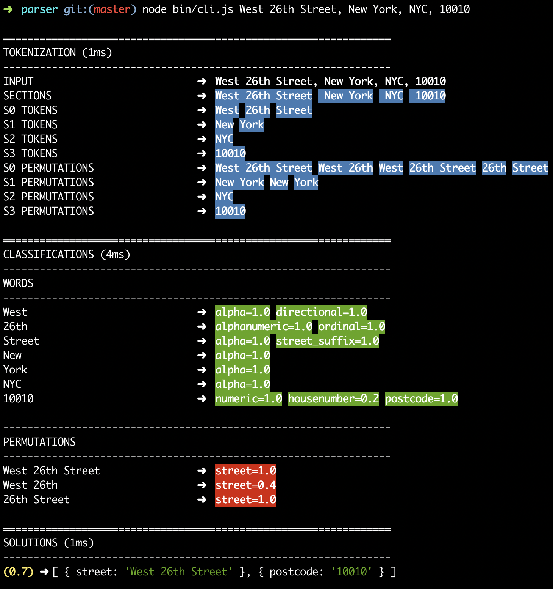

An address parsing engine designed for geocoding.

Strategic goals:
- Seperate unit, housenumber, road from 'everything else'
- Does not require a corpus of 'real places' to operate
- Do not attempt to classify administrative areas
- Provide multiple solutions in the case of ambiguous parses
- Basic typo correction
- Honour delimiters
- Extensible to handle queries such as 'pizza near new york'
- Record offsets to the original token positions in the input text
- Pluggable classifiers
- Support for partially complete 'autocomplete' tokens 

#### CLI

```
node bin/cli.js West 26th Street, New York, NYC, 10010
```



It's still very early stages but this is the basic architecture:

#### Server

```bash
$ PORT=6100 npm run server;
```

### open browser

the server should now be running and you should be able to access the http API:

```bash
http://localhost:6100/
```

try the following paths:

```javascript
/parser/parse?text=12 main st
```

### Architecture overview

#### 1. start with an input:
```
30 West 26th Street, New York, NYC, 10010
```

#### 2. split tokens in to logical groups:
```
[
  "30 West 26th Street",
  "New York",
  "NYC",
  "10010"
]
```

#### 3. tokenize groups:
```
[
  [ "30", "west", "26th", "street" ],
  [ "new", "york" ],
  [ "nyc" ],
  [ "10010" ]
]
```

#### 4. generate permutations:
```
[
  [
    "30 west 26th street",
    "30 west 26th",
    "30 west",
    "30",
    "west 26th street",
    "west 26th",
    "west",
    "26th street",
    "26th"
  ],
  [
    "new york",
    "new",
    "york"
  ],
  [ "nyc" ],
  [ "10010" ]
]
```

#### 5. run classifiers against all permutations and record potential classes per permutation
```
'10010' -> postcode
'west 26th street' -> street
'26th street' -> street
'street' -> street_postfix
```

#### 6. generate solutions

Given the classifications for each permutation, compute an array of potential parses for the input, a confidence score can also be provided.